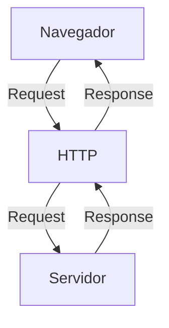
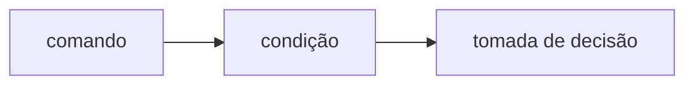
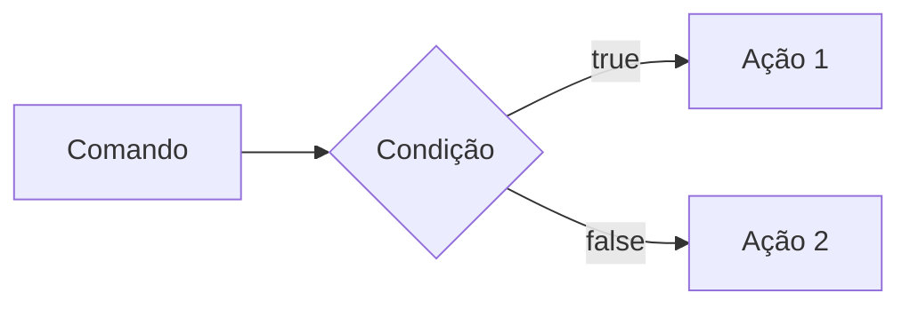
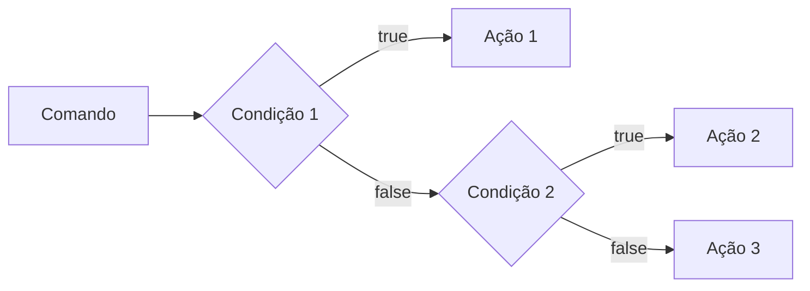
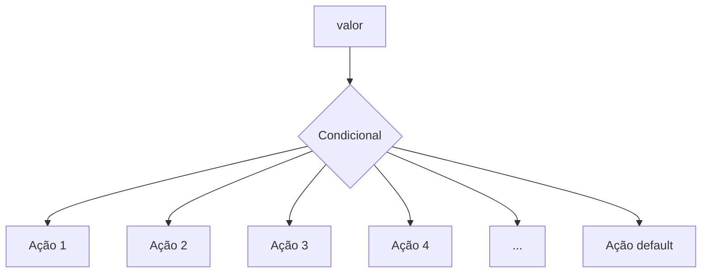
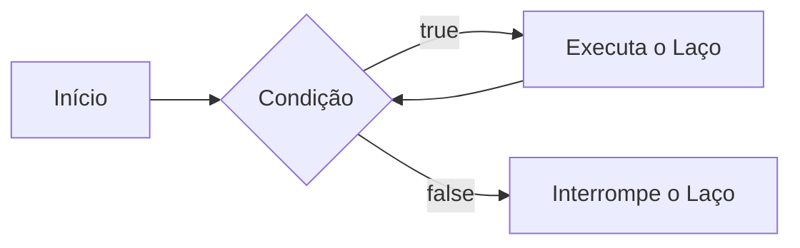
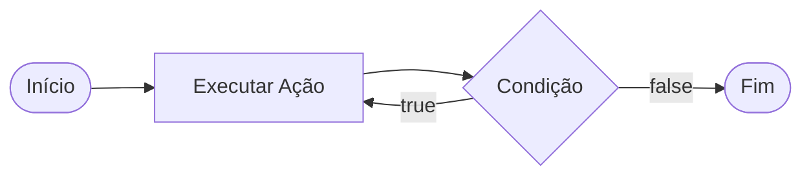
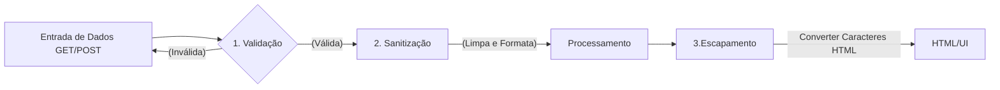

# Curso BackEnd -  1º Semestre - 105h

Prof. Diogo Barbosa

Escola SENAI Americana 

2º Semestre 2026

## Objetivos do Curso

- Desenvolver Aplicações web Server Side, utilizando a linguagem PHP;
- Aplicar Sintaxe nativa Php Vanilla;
- Manipulação HTTP;
- Persistência de Dados(Armazenamento em BD);
- Segurança contra SQL Injection/CSRF;
- Refatoração em POO (Programação Orientada Objeto);
- Arquitetura MVC;
- Utilização do FrameWork Laravel;

## Cronograma do Semestre

Carga Horária: 105h

Duração: 20 Semanas

### Semana 1: Introdução ao BackEnd e Configuração do Ambiente PHP

#### O que é BackEnd

O back-end é a parte de um site ou aplicativo que o usuário não vê, mas que faz tudo funcionar por trás das telas.

- Guarda e organiza informações em um banco de dados;
- Confere se o login e a senha estão corretos;
- Calcula valores, como o frete ou o total de uma compra;
- Garante que os dados de um usuário não apareçam para outro;
- Faz o sistema suportar muitas pessoas usando ao mesmo tempo, sem travar.

As principais linguagens utilizadas no desenvolvimento back-end são PHP, JavaScript/TypeScript, Python, Java, Kotlin, Go (Golang), C# e Rust. 

O backend é o "cérebro" oculto de um site ou aplicativo. Ele roda em um servidor e cuida de tudo o que o usuário não vê na tela.

**As 3 partes básicas de todo backend:**

1. **Servidor:** o "computador" que fica ligado esperando pedidos (requisições);
2. **Banco de dados:**  onde as informações ficam guardadas (usuários, produtos, mensagens, etc.);
3. **Lógica de negócio:**  as regras do sistema (ex: "não deixa comprar se não tiver estoque").

**O Mercado de Trabalho em Back-end**

O desenvolvimento Back-end é uma das áreas mais cruciais da Tecnologia da Informação. 

- Com a transformação digital acelerada, empresas de todos os portes e setores dependem de infraestruturas sólidas e seguras. 

- Setores de Atuação: Bancos, hospitais, e-commerces, logística, indústrias, startups e órgãos públicos utilizam Back-end para suportar suas operações críticas.

- Fatores de Crescimento: O avanço da computação em nuvem, aplicativos móveis, Big Data e IA impulsiona continuamente a busca por profissionais da área.

- Modelos de Trabalho: Alta flexibilidade com vagas presenciais, híbridas e remotas (inclusive com oportunidades internacionais).

#### Ciclo de Vida da Requsição HTTP

##### O que é HTTP

**HTTP**, Hypertext Transfer Protocol, é um protocolo de comunicação utilizado para transferência de informações na WWW(World Wide Web) e em outros sistemas de Redes.

O HTTP é a base para que o cliente e um servidor web troquem informações. Ele permite a requisição e a respostas de recursos, como imagens, arquivos e as própias páginas web, por meio de mensagens padrão (protocolo).

##### Como Funciona o HTTP

1. O cliente estabele contato com o servidor, encamihando uma requisição HTTP;
2. Nessa Requisição o cliente especifica o método pretendido (read-GET, create-POST, update-PUT/PATCH, delete-DELETE)
3. o Servidor processa e responde com uma mensagem HTTP, com os recursos solicitado.


---
#### Como funciona na prática o BackEnd
- **Ação do usuário:** Envia uma solicitação pela UI (Interface do Usuário). Exemplo de UI: Tela do celular, Navegador da Internet, Alexa, ...
- **Envio da requisição:** A UI transforma ação do usuário em uma requisição HTTP.
- **O Processamento BackEnd:** o Código BackEnd recebe o pedido, valida os dados e decide o que fazer (Ex: consulta uma informação no banco de dados).
- **Resposta:** o servidor devolve o resultado para UI (Ex: Um login autorizado, uma compra confirmado, uma música, ...).

## Tipos de Requisição HTTP
Os tipos de requisição HTTP indicam uma ação que o usuário deseja executar no servidor. As principais ações são: 

- **GET**: Pede dados de um lugar especifico. "Não Faz Alterações no Servidor"
- **POST:** Envia dados novos para *criar* algo ou processar informações.
- **PUT/PATCH:** Modificar dados ja existentes. *PUT* Atualização Total dos dados. *PATCH* Atualização Parcial dos dados.
- **DELETE:** Apaga um dado do Servidor


---

#### Iniciando o PHP

##### O que é PHP

**PHP** (Hypertext PreProcessor) é uma liguagem de programação interpretada e open source, focada no desenvolvimento de sistemas para web, pode ser usada junto com HTML para criação de págians web dinâmicas.

##### Instalando o PHP

- Fazer o Download do PHP (php.net);
- ZIP - Non Thread Safe 8.5
- Descompactar o arquivo do PHp na pasta C:\src\php (Para descompactar, usar 7zip)
- Modificar o arquivo php.ini-development para => php.ini (criar as configurações do PHP na máquina) - adicionar ou remover funcionalidades do PHP
- Adicionar a pasta do PHP (C:\src\php) as Variaveis de Ambiente do Sitema (PATH) 
- Verificar a instalação rodando o comando php --version

##### Contextualizando o PHP

O PHP de fato é uma das linguagens de programação mais populares da atualidade. Ela permite que você crie aplicações web robustas, muito simplificada direto ao ponto. Sem contar que a linguagem traz diversos recursos que facilitam e aceleram o processo de desenvolvimento de sites e sistemas para web. E além do mais, ela ainda tem um ótimo ecossistema, uma excelente comunidade e um grande mercado de trabalho.

##### Criando minha primeira aplicação em PHP

Criando um Hello, World!!!

##### Crinado o peril de PHPVanilla

-> Profile -> New Profile
-> Extensions:
- PHP IntePhense (A do elefantinho) : Autocomplear (snipets)
- PHP Debug (Xdebug): Acha erros em linha de código
- PHP CS FIXER: Formatação padrão do código (identação)
- PHP Serve: Sobe um serivdor local para acompanhamento em tempo real
---
##### Estudo de variáveis e constantes em PHP

Declarar variáveis é alocar um espaço na emoria que permite a inclusão e manipulação de dados.

**Variáveis**
- devem ser declaradas usando "$" antes do nome da variável
- podem ser string, numerica (integer, float), booleanas e nulas. não permite declaração de undefined
- são nao tipadas, ou seja, não precisa declarar o tipo na declaração, a tipagem é atribuída ao adicionar o valor
- usar o "declare(strict_types=1);" na primeira linha do arquivo ; => blindar o sistema contra conflitos de tipos de variáveis.

**Constantes**

- não podem ser modfificadas ou redeclaradas após a criação
- pode ser criada usando "const" ou "define"
- não permitem interpolação


### Semana 2 - Operadores em PHP (Aritméticos, Relacionais e Lógicos)

##### Estudos de operadores

 **Aritméticos**:são usados para realizar cálculos
 
 | operadores | nome | exemplo | resultado |
 | - | - | - | - |
 | + | adição | 10 + 5 | 15 |
 | - | subtraão | 10 - 5 | 5 |
 | * | multiplicação | 10 *5 | 50 |
 | / | divisão | 10 / 5 | 2 |
 | % | módulo (resto) | 10 % 3 | 1 (10 div 3 da 3, sobra 1) |
 | ** | expoente | 2 ** 3 | 8 (2 elevado a 3) |

 obs: O Operador % é o melhro amigo de um programador, permite ordenas listas e organizar fila e pilhas
 
 ---

 **Relacionais**: são usados para comparar dois ou mais valores, tendo sempre uma booleana (true or false) como resultado

 | operadores | nome | exemplo | resultado |
 | - | - | - | - |
 | == | igual a | "10"==10 | true |
 | === | igualdade estrita | "10"==10 | false |
 | > | maior que | 18 > 18 | false |
 | < | menor que | 10 < 15 | false |
 | >= | igual ou maior | 18 >= 18 | true |
 | <= | igual ou menor | 10 <= 5 | false |
 | != | diferente | "10"!=10 | false |
 | !== | diferença estrita | "10"!=10 | true |

 ---

 **Lógicos**Permite a Combinação entre sentenças.

- Operador AND (E) => && : para o resultado se verdaddeiro, TODAS as Combinações precisam ser verdadeiras
    - true && true => true
    - true && false => false

- Operador OR (OU) => || : para o resultado ser verdadeiro , Basta APENAS UMA condição ser verdadeira
    - false || true => true
    - false || false => false

- Operador NOT (Não) => ! : Inverte a lógica da Sentença
    - !true => false
    - !false => true

### Semana 3 - Estrutura de Controle de Dados ( Condicionais e Repetição)

- **Conteúdo**: Estruturas `if`, `else`, `elseif`, operadores ternários, `match` => substituto do `swicth/case`, loops `for`, `while`, `do-while` e `foreach`

#### Estrutura de Controle de Dados ajudam no processo de automatização em programas e sistemas

##### Condicionais (IF, ELSE, ELSEIF)

- **Forma de Uso**:

Uso do `if` apenas 
Exemplo: aplicar um desconto de 10% em comrpas acima de 100 Reais;


comando -> condição -> Tomada de Decisão 
```php
if ($valorCompra > 100) {
    $valorCompra = $valorCompra * 0.9;
}
```

- Uso do `if `e do `else`
Exemplo: Aplicar um desconto de 10% para compras acima de 100 reas e 5% para as demais compras



```php

if($valorCompra > 100) {
    $valorFinal = $valorCompra*0.9;
} else{
    $valorFinal = $valorCompra*0.95;
}

```
- Uso do `elseif` (Encadeado)
Exemplo: Compras acima de 200 reais tem 15% de desconto, acima de 100 reais tem 10% de desconto e outras 5% de desconto



```php
if($valorCompra > 200){
    $valorFinal =$valorCompra*0.85;
}
elseif($valorCompra >100){
    $valorFinal -$valorCompra*0.9;
} 
else {
    $valorFinal = $valorCompra*0.95;
}

```

*obs*: sempre usar `elseif`para situações que precisam de mais de uma condição, ou seja, fazer encadeamento das condições.

 - Uso **ERRADO** do if
 Não fazer o encadeamento de condicionais:
 ```php

if($valorCompra > 200) {
    $valorFinal = $valorCompra*0.85;
}
if($valorCompra > 100) {
    $valorFinal = $valorCompra*0.90;
}
if($valorCompra < 100) {
    $valorFinal = $valorCompra*0.95;
}

```

##### Operadores Ternários
Um atalho para a estrutura condicional `if/else`, normalmente escrito em uma unica linha de código.

`condição ? verdadeira : falso `

perfeito para decisões curtas de uma linha de comando
Exemplo: Verificar se a pessoa é maior de idade (+18)

```php

$idade = 20;
// o formato de escrita é: (condição) ? verdadeiro : falso;

$status - ($idade >= 18) ? "maior de idade" : "Menor de idade";
$status2 = ($idade<18) ? "Criança" : ($idade<60) ? "Adulto" : "Idoso"; 
```


##### Expressão condicional `match `(PHP 8)

No mercado de PHP atual, não se usa mais uma dezena de `if/elseif`para checar valores fixos, e o antigo `switch/case`caiu em desuso. Usamos o `match`. Ele compara um valor e retorna diretamente o resultado.



```php
$diaSemana = date ("week"); //pega o dia da semana em formto número
//transformar dia da seamana em formato texto (domingo, segunda,...)

$nomeDiaSemana = match ($diaSemana){
    "0" => "Domingo",
    "1" => "Segunda",
    "2" => "Terça",
    "3" => "Quarta",
    "4" => "Quinta",
    "5" => "Sexta",
    "6" => "Sábado",
    default => "Dia Inválido"
};
```
---

##### Laços de repetição 

Um laço de repetição faz com que, um bloco de códigos rode várias vezes, até que uma condição mande parar.
 
- O Laço `while`(enquanto)
 Ele verifica se a condição é verdadeira ANTES de entrar no laço. Ideal quando você nao sabe quantas vezes vai rodar o laço.



Exemplo: Jogo de Adivinhação de um nº Secreto

```php

$numeroSecreto = 7;

$tentativas = 0;

while($tentativa != $numeroSecreto){
    echo "Tente Novamente"
    //vou pegar um número aleatório entre 1 e 10
    $tentativa = rand(1,10);
}
echo " Acertou Miseravi!!! o número secreto é $numeroSecreto"
```
- While testa primeiro a condição para depois executar, podedno resultar em erros de lógica  
---
- O Laço `do-while`(Faça enquanto)
A diferença é que ele executa o bloco pelo menos uma vez, mesmo que a condição seja falsa desde o início, pois ele só pergunta no final


Exemplo: Jogo de adivinhação
```php

$numeroSecreto = rand (1,10)

do{
    $tentativa = rand(1,10); //Simular um palpite aleatório
    if ($tentativa == $numeroSecreto){
        echo "Parabéns, acertou!!"
    }
} while (tentativa != $numeroSecreto);

```
obs: Uso ideal do `do-while`: menus de sistema ou sistemas de dados, sistemas interativos.

##### O Freio de Emergência: `break` e `continue`

As vezes precisamoso interferir no laço enquanto ele está rodando 

- `break`=> **Para Tudo!** Quebra o laço interiro e avai embora
- `continue` => **Pula a rodada!** Ele ignora o código daquela rodada especifica e pula logo par a próxima repetição.

Exemplo de Aplicação do Código: Sistema de Controle do Elevador

```php 

for($andar = 1 ; $andar<=10; $andar++){
    if($andar ==4){
        echo "Andar $andar está em obras. Passando direto!";
        continue;
    }

    echo "Elevador parou no andar $andar"
}

```
---

#### Laço de Repetição `for`

Use o `for`quando você sabe quantas vezes precisa repetir uma ação ou quando precisa controlar um contador. Ele possui 3 partes:
 - inicialização;
 - condição;
 - incremento. 

 sintaxe:

 for (inicialização; condição; incremento){
    Ação
 }

 ```mermaid
 flowchart LR
 A[Início: i=0] -->{1<10?}
 B --true--> C [Ação]
 C --> D [i++]
 B --false--> E[FIM]
 ```

 Exemplo de aplicação: Exbir todo os Meses do ano

 ```php
 for($mes=1;$mes<=12;$mes++){
    echo Mes$mes
 }
 ```
 Nesse exemplo. `$mes`coemça em 1, o laço continua enqaunto `$mes`for menos oq a 12, e, ao final de cada repetição, `$mes`aumenta o contador em 1.

 ##### Laço de Repetição `foreach`

Use o `foreach`quando precisar percorrer cada item de um **array**. Ele acessa os elementos diretamente, sem que você precise controlar o contador.

Exemplo: Imprimir todos os itens de um vetor.

```php 
$frutas = ["Maça", "Banana","Uva","laranja"];
 foreach ($frutas as $fruta){
    echo "Fruta: $fruta";
 }
 ```

 Outro Exemplo: Acessar a chave e o valor de cada item:

 ```php 
$preços = [
    "caderno" => 25.00,
    "caneta" => 5.50,
    "mochila" => 99.00

];

 //vetor não ordenado do tipo chave (key) =>  valor(value)===> coleção/dicionario

//percorrer o vetor usando o laço foreach
foreach($precos as $produto => $preco){
    echo "$produto: R$" . number_format ($preco,2);

}
```
---
---

#### Desafio : Simulador de cobrança (FINANSENAI)

#### Desafio Final

---
---

### Semana 4 - Modularização com Funções

#### Princípio do DRY (Don't Repeat Yourself)

Se uma lógica foi escrita duas ou mais vezes dentro de um código, essa lógica deve virar uma função.

#### Funções Nativas do PHP

O PHP tem milhares de funções prontas, essa função já criada é chamada de função nativa.

- **O que é uma Função?**

Uma função é como uma máquina: você coloca a matéria-prima (Parâmetro), ela processa e devolve um produto final (Retorno)

Exemplo de Função Nativa

```php
$texto = "senai americana";

// usar uma funçaõ nativa para substituição de uma parte do texto ==> str_replace
$textoNovo = str_replace("americana", "são paulo", $texto);
// "senai são paulo"

// usar uma função nativa para substituição da letras minúsculas por letrar maiúsculas => strtoupper
echo strctoupper ($textoNovo); // SENAI SÃO PAULO 
```

##### Principais Funções Nativas (Mais Utilizadas)
As funções abaixo já fazem parte do PHP e podem ser chamadas diretamente no código. Observe os parâmetros que cada uma recebe e o tipo de informação que ela retorna.

| Função | Categoria | O que faz | Como usar |
|---|---|---|---|
| `strlen()` | Strings | Retorna a quantidade de caracteres de um texto. | `$tamanho = strlen($texto);` |
| `strtoupper()` | Strings | Converte o texto para letras maiúsculas. | `$resultado = strtoupper($texto);` |
| `strtolower()` | Strings | Converte o texto para letras minúsculas. | `$resultado = strtolower($texto);` |
| `ucfirst()` | Strings | Converte a primeira letra do texto para maiúscula. | `$resultado = ucfirst($texto);` |
| `trim()` | Strings | Remove espaços e quebras de linha no início e no fim do texto. | `$limpo = trim($texto);` |
| `str_replace()` | Strings | Substitui uma parte do texto por outra. | `$novo = str_replace("-", "", $cpf);` |
| `substr()` | Strings | Extrai uma parte do texto a partir de uma posição. | `$inicio = substr($texto, 0, 3);` |
| `explode()` | Strings | Divide um texto e cria um array usando um separador. | `$palavras = explode(" ", $nome);` |
| `implode()` | Arrays | Junta os itens de um array em um único texto. | `$lista = implode(", ", $nomes);` |
| `count()` | Arrays | Conta a quantidade de itens de um array. | `$total = count($produtos);` |
| `in_array()` | Arrays | Verifica se um valor existe dentro de um array. | `$existe = in_array("SP", $estados, true);` |
| `array_push()` | Arrays | Adiciona um ou mais itens ao final de um array. | `array_push($nomes, "Ana");` |
| `array_pop()` | Arrays | Remove e retorna o último item de um array. | `$ultimo = array_pop($nomes);` |
| `sort()` | Arrays | Ordena um array em ordem crescente e reorganiza suas chaves. | `sort($notas);` |
| `array_keys()` | Arrays | Retorna um array contendo as chaves de outro array. | `$chaves = array_keys($produtos);` |
| `number_format()` | Números | Formata um número com casas decimais e separadores definidos. | `$preco = number_format($valor, 2, ',', '.');` |
| `round()` | Números | Arredonda um número para a quantidade de casas informada. | `$media = round($nota, 2);` |
| `max()` | Números | Retorna o maior valor de uma lista ou array. | `$maior = max($notas);` |
| `min()` | Números | Retorna o menor valor de uma lista ou array. | `$menor = min($notas);` |
| `is_numeric()` | Validação | Verifica se o valor é um número ou uma string numérica. | `if (is_numeric($entrada)) { ... }` |
| `isset()` | Validação | Verifica se uma variável existe e não possui valor `null`. | `if (isset($usuario)) { ... }` |
| `empty()` | Validação | Verifica se uma variável está vazia. | `if (empty($pedido)) { ... }` |
| `date()` | Data e hora | Formata uma data ou hora conforme uma máscara. | `$hoje = date('d/m/Y');` |
| `file_exists()` | Arquivos | Verifica se um arquivo ou diretório existe. | `if (file_exists('dados.txt')) { ... }` |
| `file_get_contents()` | Arquivos | Lê todo o conteúdo de um arquivo ou endereço. | `$conteudo = file_get_contents('dados.txt');` |
| `file_put_contents()` | Arquivos | Grava conteúdo em um arquivo, criando-o se necessário. | `file_put_contents('log.txt', $mensagem);` |

**Atenção:** algumas funções modificam o array original, como `sort()`, `array_push()` e `array_pop()`. Já outras retornam um novo valor, como `count()`, `explode()` e `str_replace()`. Em caso de dúvida, consulte a documentação oficial do PHP e verifique o retorno da função.


##### Documentação do PHP 

[Acesse a documentação oficial do PHP em português](https://www.php.net/manual/pt-BR/) 

Consulte tambem a [referência de funções do PHP em ](https://www.php.net/manual/pt-BR/funcref.php) para pesquisar a sintaxe, os parâmetros e os valores para cada função.

#### Funções Cusstomizadas (criando suas próprias máquinas)

Quando o PHP não tem a função que queremos, nós a criamos!

**A Regra de Ouro**: uma função deve focar em `return`(retornar um valor), e não imprimir (`echo `).

Veja a diferença nesse exemplo:

```php
function calcularTotal($preço, $quantidade) {
    //a função calcula e retorna o resutado, mas não imprime nada
    return $preço * $quantidade;
}
$total = calcularTotal(25.00, 3);

// imprimir é feito fora da função
echo "Total da compra: R$" .roud($total,2);
// total da compra é: R$75.00
```

A função `calcularTotal`pode ser reutilizada em uma página, reltório ou teste. O `echo`aparece somente fora da função, no momento de apresentar o resultado para o usuário.

##### Padrão de uso corporativo (PHP 8 Strict Types)

No mercado de trabalho, exigimos que a função avise exatamente o **TIPO** de dao que ela espera receber e o **TIPO** de dado que ela vai devolver.

Isso é chamado de **Tipagem de funções**. Ao declarar os tipos, o código fica masi fácil de entender e o PHP consegue indentificar alguns erros antes q eles causem problemas maiores no sistema.

Os tipos mais usados:

* `int`: número inteiro, `10`ou `1024`;
* `float`:número decimasl u ponto flutuante, `10.90`;
* `string`: texto, como `"Maria"`;
* `bool`:valor lógico, `true`ou `false`;
* `void`:identifica que a função não devolve nenhum valor;

O tipo deve ser escrito antes o nome de cada parâmetro e o tipo da função deve ser escrito após os parênteses, procedido do ":", informando o que a função ai devolver

Exemplo de uso de função e parâmetros tipados:

```php
function apresentarProduto(string $nome, float $preço): string{
    return "$nome custa R$ $preco";

}

$mensagem = apresentarProduto ("caderno",25.00);
echo $mensagem;
// caderno custa R$25.00

```
> **Resumo**: os tipos dos parâmetros documentam as entradas da função, o tipo pós `:`documenta a saída da função.

#### O Tipo mágico: `VOID`

 seu uma função faz um trabalho interno e **não retorna NADA**, dizemos que o retorno dela é "vazio"(VOID).

 Exemplo de função sem retorno:

 ```php
 function registraLog(string $mensagem): void{
    //apenas salve em um arquivo de texto, não devolver nenhuma variável
    file_put_contents("erro.log", $mensagem);
 }
 ```

 #### Escopo e Referencia (O Segredo da Memória)

##### O que é Escopo? ( A Regra de Las Vegas)

*O que acontece dentro da função, fica dentro da função*. Uma variável criada fora não existe la dentro, e uma criada la dentro, morre quando a função acaba.

**Escopo** é o local do programa onde a variável pode ser aramazenada/acessada. Em PHP, uma variável criada fora de uma função pertence ao *escopo global*, uma variável criada dentro de uma função pertende ao *escopo local*.

Exemplo de Escopo de variável:

```php
$nomeSistema = "CRM SENAI"; //varivel global

function criarMensagem(string $nome): string{
    $mensagem = "Bem-vindo!!!"; // escopo global
    return $mensagem . $nome;
}
echo $nomeSistema; //correto ; esta no escopo global
// echo $mensagem; // incorreto ; $mensagem so existe dentro da função, não é acessada fora
echo criarMensagem("nome do fulano"); // correto ; a função devolve sua variável local 
// CRM SENAI
// Bem-vindo!!! nome do fulano
```

* *Como Enviar Dados Para uma Função?*

A forma mais segura e organizada é enviar os dados por **Parâmetros**. Assim, a função não precisa acessar diretamente variáveis globais:

```php

function saudar(string $nome):string{
    return "Olá, $nome!";
}

$nomeCliente = "João";
echo saudar($nomeCliente); // Olá, João!
```

Nesse Caso , `$nomeCliente` continua no escopo global, mas seu valor é enviado para o parâmetro local `$nome`. Afunção recebe uma informação, processa e retrona o resultado.

**Exemplo Incorreto:**

```php

function saudar() :string{
    return "Olá, $nome"; // Errado: a função não reconhece a variável global 
}
```
A função `saudar()`não conhece a variável global `$nome`. Ocasionando um erro no sistema.

> **Resumo**: vriaveis protegem os dados internos da função;parâmetros são o caminho recomendado para evitar erros e enviar informações, e `return`é usado par devolver um resultado ao código que chamou a função.
---

### Semana 5- Arrays e manipulação avançada de dados

Um array (também conhecido como vetor) é um aestrutura de dados usada para armazenar vários valores em uma única variável.

**Tipos de array em PHP:**
- *Indexados/Ordenados (Númericos):* Usam números inteiros como índices (chaves), que começam em zero por padrão;
- *Associativos/Não ordenados (strings):* Usam chaves (string) para indentificar valores;
- *Multidimensionais:* Contêm um ou mais arrays dentro de outros arrays.

**Exemplo de arrays:**

```php
//array indexado
$frutas = ["maçã", "banana", "laranja"];

//array associativo
$capitais =[
    "SP" => "São Paulo",
    "MG" => "Belo horizonte",
    "RJ" => "Rio de janeiro",
    "ES" => "Vitória"
];

//acessando dados
echo $fruta[0]; //"maçã"
echo $capitais["SP"]; //"São Paulo"

```
>OBS: em arrays associativos, nós trocamos os nº do indice por nomes (chaves/keys). A setinha => significa "recebe".

**Arrays multidimenisionais (Banco de dados na memória):**
É aqui que o "BackEnd"começa de verdade. O Array multidimensional é o formato como os banco de dados chega como respostas as solicitações feitas pela API.

```php 
$clientes = [
 ["id" => 1, "nome"=>"Ana", "email"=>"ana@email.com", "ativo"=> true],
    ["id" => 2, "nome"=>"Bruno", "email"=>"bruno@gmail.com", "ativo"=> false],
    ["id" => 3, "nome"=>"Carlos", "email"=>"carlos@hotmail.com", "ativo"=>true]
];

//como acessar o email do Bruno
echo $clientes[1]["email"];//bruno@gmail.com
```
#### O Melhor Amigo dos Array: `O Foreach`

O laço de repetição especial para arrays. o `foreach`percorre cada elemento de um array.

**Exemplo de Aplicação:**

```php
foreach($cliente as $clienteAtual){
    echo $clienteAtual["nome"];
    echo $clienteAtual["email"];

}
//vai imprimir nome e email de todos os clientes do array
```

#### Tranformações de arrays (arrow function)

São Usadas em Filtragem de e Mapeamento de dados de um Array

- *`array_filter`*
Serve para buscar dados. e devolve apenas os dados que passarem pelo filtro

```php
$clientesAtivos = array_filter($clientes, fn($c) => $c["ativo"]===true);

//novo array , tera apenas os clientes que ativo por igual a true
```

- `array_map`
Serve para alterar Todos os dados de uma lista de uma única vez

```php
$produtos = [
    ["id"=>1, "preco"=10.00, "setor"=>"jardim"],
    ["id"=>2, "preco"=15.90, "setor"=>"ferramentas"],
    ["id"=>3, "preco"=20.00, "setor"=>"jardim"],
];
//ajuste de preço 10%
$produtosAjustados = array_map(fn($p)=>$p[preco] = $p[preco]*1.1, $produtos)
```
#### Debugando um Array (Kit Primeiro Socorros)

- `print_r`
função usada para exibir informações sobre uma variávels de forma legível em linguagem natural

```php 
print_r($frutas);

//Array
(
    [0] => "maçã",
    [1] => "banana",
    [2] => "laranja"
)
```

- `var_dump`
exibe com mais detalhes as informações de um array ou variável em PHP

```php
echo var_dump($frutas);
//Mostra Tudo: tipo de dados, o tamanho e o valor
```
--- 

### Semana 6 - Processamento HTTP e Formulario Web

#### Anatomia de um formulário HTML para BackEnd

antes de PHP processar qualquer informaçã, precisamos coletar infomações do FrontEnd através de um `<form>

** Exemplo de `<form>`HTML 

``` html
<form action="procesa.php" methood="POST">
    <label>nome completo </label>
    <input type="text" id="campoNome" name="nomeUsuario" placeholder="Digite seu nome">
    <button type="submit">Cadastrar</button>
</form>>
```

**Os 3 pilares do formulário:**
1. action="procesa.php" -> O destino: defne qual script PHP no servidor recebeá os dados.
2. methood="POST" -> O Transporte: Define a vida de protoolo HTTP usada (GET ou POST).
3. name="nomeUsuarios" -> A Etiqueta do Dado: É o nome da chave que o PHP usará no array associativo ($POST["nomeUsuario"]).

> obs: Nunca Confundir `id` com `name` no input, o PHP ignora o `id`

#### O Protocolo HTTP

Quando o Usuário clica no botão `type="submit"`, o navegador compila todas as informações dos campos preenchidos e dispara um pacote de comunicação padronizado pelo **Protocolo HTTP(Hypertext Transfer Potocol)**

**O Formato de transferência**

-**Método GET**: solicitar infromações públicas e realizar buscas, mas altamente arriscada para dados privados;

-**Método POST**: As informações viajam guardadas dentro do protocolo

#### Testar o uso dos Protocolos HTTP
 
OK

#### GET vs. POST   

1. O método `GET`é utilizado quando a intenção do cliente é **buscar ou filtar dados** sem alterar o estado do serviddor. Os dados enviados via `GET`são anexados diretamente ao final da URL na forma de uma **Query String**

2. O método `POST`é utilizado quando o formulário envia dados que devem ser processados para **criar ou modificar** no sistema (ex: cadastro de usuários, finalizações de compras, upload de arquivos)


#### Como os Métodos Funcionam no PHP (`$_GET`, `$_POST`, `$_SERVER`) - As SuperGlobais

As variáveis SuperGlobais são arrays internos pré-definidos que etsão sempre acessiveis em qualquer parte do script php, sem precisar ser declaradas.

- **$_GET**: Armazena dados passados pela URL via parâmetros de consulta (query string);
- **$_POST**: Recolhe dados enviados por formulários usando método HTTP POST;
- **$_SERVER**: Contém infromçaões sobre o servidor, ambiente e caminhos de script.

**Poque usamos  `??`para obter dados da SuperGlobal?**

Usamos o Operador de Nulidade (Coalescência Nula) para verificar se o valor da variável não é `null`, se caso for, atribuímos um valor para evitar erros no script.

**Exemplo de uso:**
Na primeira vez que uma página é aberta, o formulário ainda não foi enviado. Portanto, a chave pode não existe no array.

```php
$nome = $_POST["nome"];
//se escrever dessa froma, o código pode gerar um aviso de erro.

//a forma correta de escrita é:
$nome = $_POST ["nome"] ?? "";
// se $_POST["nome"] não existir, use uma string vazia.

//outra froma de verificar nulidade é usando if/els
if(isset ($_POST["nome"])){
    $nome = $_POST["nome"];
} else{
    $nome = ""
}
```

#### Validação de Dados no BackEnd é obrogatória

Muitos desenvolvedores iniciantes acreditam que colocar atributos `required`, `type="email"` ou `min=0` na <tag> do HTML é suficiente para proteger o sistema. **Isso é Ilusão**. Sempre devemos fazer validações de dados no código BackEnd. As validações no BackEnd devem acontecer sempre antes do processamento de qualquer dado recebido pelo usuário.

##### Funções Nativas Essenciais para Limpeza e Validação de Dados


Abaixo está uma tabela resumida das funções nativas do PHP usadas com frequência para limpar, verificar e validar entradas de formulário.

| Função | Descrição | Quando usar | Exemplo simples |
| :--- | :--- | :--- | :--- |
| `trim($valor)` | Remove espaços no início e no fim da string | Limpar texto digitado pelo usuário | `$nome = trim($_POST['nome'] ?? '');` |
| `htmlspecialchars($valor, ENT_QUOTES, 'UTF-8')` | Converte caracteres especiais em entidades HTML seguras | Exibir dados na tela sem risco de XSS | `echo htmlspecialchars($_POST['nome'] ?? '', ENT_QUOTES, 'UTF-8');` |
| `filter_var($valor, FILTER_VALIDATE_EMAIL)` | Valida formato de e-mail | Campos de e-mail | `filter_var($email, FILTER_VALIDATE_EMAIL)` |
| `filter_var($valor, FILTER_VALIDATE_INT)` | Verifica se o valor é inteiro válido | Idade, código, quantidade | `filter_var($_POST['idade'] ?? '', FILTER_VALIDATE_INT)` |
| `filter_var($valor, FILTER_VALIDATE_FLOAT)` | Verifica se o valor é número decimal válido | Preço, peso, altura, salário | `filter_var($_POST['preco'] ?? '', FILTER_VALIDATE_FLOAT)` |
| `isset($variavel)` | Verifica se uma variável existe e não é `null` | Garantir que o campo foi enviado | `if (isset($_POST['nome'])) { ... }` |
| `empty($valor)` | Verifica se o valor está vazio | Campos obrigatórios | `if (empty($_POST['senha'])) { ... }` |
| `strlen($valor)` | Retorna o tamanho da string | Exigir mínimo ou máximo de caracteres | `if (strlen($senha) < 6) { ... }` |
| `in_array($valor, $lista, true)` | Verifica se o valor pertence a uma lista permitida | `select`, `radio`, opções válidas | `in_array($categoria, ['A','B','C'], true)` |
| `is_numeric($valor)` | Confirma se o valor é numérico | Validação de número | `if (is_numeric($_POST['quantidade'])) { ... }` |
| `preg_match($padrao, $valor)` | Valida por expressão regular | CPF, CEP, telefone, senha forte | `preg_match('/^\d{5}-\d{3}$/', $cep)` |
| `filter_input(INPUT_POST, 'campo', FILTER_SANITIZE_SPECIAL_CHARS)` | Captura e limpa dados da requisição | Ler entradas com segurança | `$nome = filter_input(INPUT_POST, 'nome', FILTER_SANITIZE_SPECIAL_CHARS);` |

>obs: use `htmlspecialchars() ao exibir valor em HTML => converte caracteres especiais em entidades correspondentes em HTML, evitando que o código seja interpretado erradamente pelo navegador. É usado principalmente na segurança web, para evitar atques Cross-Site-Scriptinf(XSS).


#### Presenvação de Estado em Formulários (*Sticky Form*)

A técnica do **Sticky Form** consiste em imprimir de volta o valor no atributo "value" do input, os dados que o usuário acaba de digitar, os valores são devolvidos aos inputs, caso ocorra algum erro de validação de dados no envio.

**Exemplo de Uso:**

```php
<div class="campo">
    <label for="nome">Nome Completo</label>
    <input type="text" id="nome" name="nome" 
            value="<?= htmlspecialchars($dadosFormulario['nome'] ?? '') ?>"
            class="<?= isset($erro['nome']) ? 'input-erro' : '' ?>">
    <?php if (isset($erro["nome"])): ?>
        <span class="erro-texto"><?= $erro["nome"] ?></span>
    <?php endif; ?>
</div>
```

### Semana 7 - Segurançanp BackEnd - Sanitização, Validação e proteção contra XSS

**1º Mandamento do Desenvolvedor backend**

>Nunca confie no usuário: toda entrada de dados vinda de fora do servidor é potencialmente maliciosa até que seja rigorosamente validade, sanitizada e codificada.

Qaundo você disponibiliza um campo de teto em um site, qualquer pessoa conectada a inernet pode digitar código maliciosos em ve de texto. Se o código Backend pega esse texto diretamente sem nenhum tartamento, a ordem de execução de código abrirá portas para a invasão devastadora do sistema.

**A Anatomia de um Ataque: O que é Cross-Site Scripting (XSS)**

O XSS ocorre quando uma aplicação web inclui dados não confiáveis em uma página web sem a devida validação ou escape de caracteres. Isso, permite que um atacante execute scripts maliciosos (geralmente em JavaScript) diretamente no navegador de outro usuário que visitam o site. 

**As Principias Modalidade de Ataques:**

1. *Roubo de Sessão(Cookies Stealing)*: O JavaScript injetado lê os cookies de autenticação da vítima (document.cookie) e os envia para o servidor do atacante, permitindo que ele faça login na conta da vítima sem precisar da senha.

2. *Desconfigurção do Site(defacement)*: Alteração visual do site, inseridno mensagens falsas, banners ofensivos ou formulários de login fraudulentos(phising interno).

3. *Redirecionamento Malicioso*: Força o navegador da vítima a abrir sites com vírus ou páginas clonadas de banco.

4. *Captura de Teclas(Keylogger)*: Grava tudo que a vítima digita enquanto a página estiver aberta. 

**Os vetores de Aatques masi frequentes:**

Nem todo ataqu XSS usa a tag óbvia `<script>`. Desenvolvedores que tentam bloquear XSS apenas "apagando a palavra script" são facilmente burlados por atacantes: 

| Vetor de Injeção | Como funciona o ataque? |
| :--- | :--- |
| `<script>alert('XSS')</script>` | Injeção direta de bloco de script executável pelo navegador. |
| `` | O navegador tenta carregar a imagem inexistente e dispara o evento `onerror` com o JavaScript. |
| `<svg onload="alert('XSS')">` | O navegador renderiza o elemento gráfico SVG e executa o evento `onload`. |
| `<a href="javascript:alert('XSS')">Clique</a>` | O clique no link executa a pseudo-URL com JavaScript em vez de abrir um site. |
| `"><script>alert('XSS')</script>` | Usado quando o dado é impresso dentro de um `<input value="...">`, quebrando o atributo e injetando a tag. |

#### **A tríade de defesa: Validação, Sanitiação e Escapamento**

1. **Validação**: Verifica se o dado recebido atende aos requisitos exatos do sistema (tipo, tamanho, formato).
 Ex: Verificar se o e-mail possui `@`e dominio válido (`filter_var($email, FILTER_VALIDADETE_EMAIL)`).

2. **Sanitização**: Transforma o dado para adequa-lo para o formato desejado, removendo caracteres indesejados.

Ex: remover espaços no início e fim (`trim($nome)`). 

3. **Escapamento/Codificação de saída**: é p ato de converter caracteres especiais de lingaguem HTML em suas respectivas **entidades HTML** no momento exato em que eles são impressos na tela.

Ex: usar `htmlspecialchars()`.



--- 

#### **A Ferramenta Principal: `htmlspecialchars()`**

É o principal mecanismo do PHP para neutralizar XSS na camada de Apresentação(UI)

**Como a conversão de entidades HTML funciona?**

| Caractere Original | Entidade HTML Gerada | Efeito no Navegador |
| :---: | :---: | :--- |
| `<` | `&lt;` (*Less Than*) | O navegador exibe `<` na tela, mas **não cria uma tag**. |
| `>` | `&gt;` (*Greater Than*) | O navegador exibe `>` na tela sem fechar tags. |
| `"` | `&quot;` (*Quotation Mark*) | Não quebra atributos HTML `<input value="...">`. |
| `'` | `&#039;` ou `&apos;` | Protege strings envoltas em aspas simples. |
| `&` | `&amp;` (*Ampersand*) | Evita interpretação incorreta de entidades. |

**A sintaxe no PHP**

```php
string htmlspecialchars(
    string $string,
    int $flags = ENT_QUOTES | ENT_SUBSTITUTE | ENT_HTML5,
    ?string $encoding = "UTF-8"
)
```
- `ENT_QUOTES`: Converte tanto aspas duplas quanto aspas simples 
- `ENT_SUBSTITUTE`: Substitui sequências de bytes inválidos por caracteres de substituição Unicode em vez de retornar uma string vazia
- `ENT_HTML5`: Aplica a tabela de entidade compatíveis com a especificação HTML5
- `UTF-8`: Garante que caracteres de lingua portuguesa como "ç", "ã", "é" sejam preservados sem corrupção.

**A função helper de Escapamento**

Para não digitar essa linha etensa em todas as parts de saída de texto para HTML, os desenvolvedores profissionais criam uma função auxiliar curta:

```php
function e(strig $texto):string{
    return htmlspeacialchar($texto, ENT_QUOTES) |
    ENT_SUBSTITUTE | ENT_HTML5, "UTF-8");
}

<p>Comentario: <?= e($comentarioUsuario) ?></p>
<input type="text" name="nome" value="<?= e(nomeUsuario) ?>" />

```

#### **Validação e Sanitazação com `filter_var()`**

O PHP ossui a biblioteca de filros nativos `filter_var()`.


```php
<?php
declare(strict_types=1);

// 1. Validação de E-mail
$email = "usuario.teste@senai.br";
if (filter_var($email, FILTER_VALIDATE_EMAIL) !== false) {
    // E-mail válido
}

// 2. Validação de Número Inteiro com Limites (Range)
$idade = "25";
$opcoesIdade = [
    'options' => [
        'min_range' => 16,
        'max_range' => 120
    ]
];
if (filter_var($idade, FILTER_VALIDATE_INT, $opcoesIdade) !== false) {
    // Idade é um inteiro entre 16 e 120
}

// 3. Validação de URLs (Links)
$website = "https://www.sp.senai.br";
if (filter_var($website, FILTER_VALIDATE_URL) !== false) {
    // URL possui protocolo e formato válidos
}

// 4. Validação de Endereço IP
$ip = "192.168.1.100";
if (filter_var($ip, FILTER_VALIDATE_IP) !== false) {
    // IP válido
}

```

