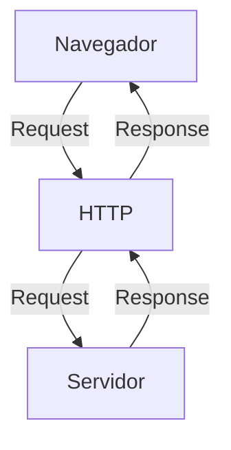
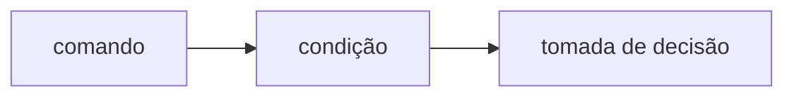
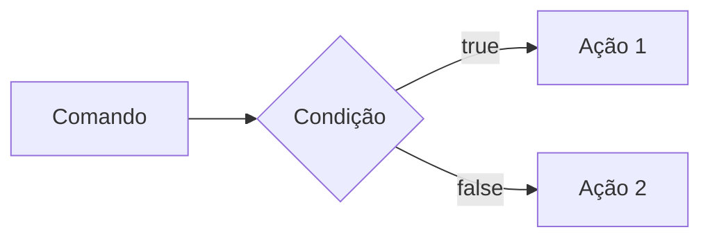
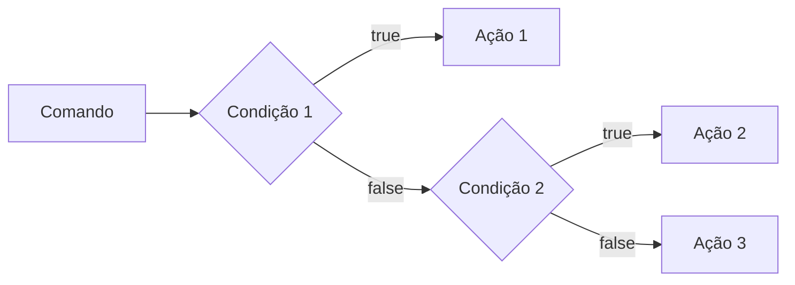
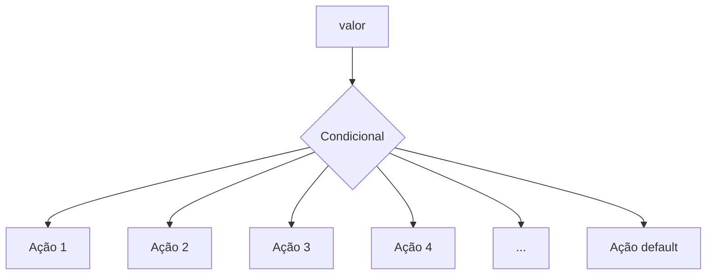
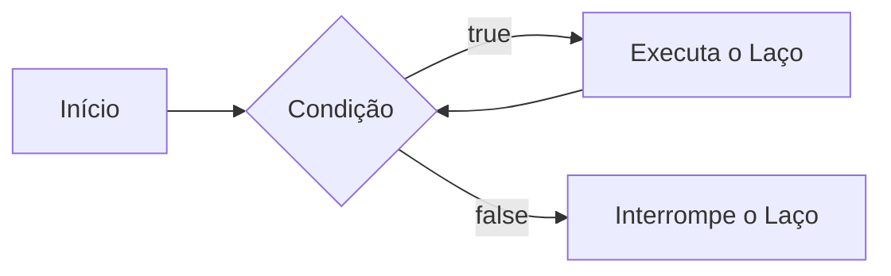

# Curso BackEnd -  1º Semestre - 105h

Prof. Diogo Barbosa

Escola SENAI Americana 

2º Semestre 2026

## Objetivos do Curso

- Desenvolver Aplicações web Server Side, utilizando a linguagem PHP;
- Aplicar Sintaxe nativa Php Vanilla;
- Manipulação HTTP;
- Persistência de Dados(Armazenamento em BD);
- Segurança contra SQL Injection/CSRF;
- Refatoração em POO (Programação Orientada Objeto);
- Arquitetura MVC;
- Utilização do FrameWork Laravel;

## Cronograma do Semestre

Carga Horária: 105h

Duração: 20 Semanas

### Semana 1: Introdução ao BackEnd e Configuração do Ambiente PHP

#### O que é BackEnd

O back-end é a parte de um site ou aplicativo que o usuário não vê, mas que faz tudo funcionar por trás das telas.

- Guarda e organiza informações em um banco de dados;
- Confere se o login e a senha estão corretos;
- Calcula valores, como o frete ou o total de uma compra;
- Garante que os dados de um usuário não apareçam para outro;
- Faz o sistema suportar muitas pessoas usando ao mesmo tempo, sem travar.

As principais linguagens utilizadas no desenvolvimento back-end são PHP, JavaScript/TypeScript, Python, Java, Kotlin, Go (Golang), C# e Rust. 

O backend é o "cérebro" oculto de um site ou aplicativo. Ele roda em um servidor e cuida de tudo o que o usuário não vê na tela.

**As 3 partes básicas de todo backend:**

1. **Servidor:** o "computador" que fica ligado esperando pedidos (requisições);
2. **Banco de dados:**  onde as informações ficam guardadas (usuários, produtos, mensagens, etc.);
3. **Lógica de negócio:**  as regras do sistema (ex: "não deixa comprar se não tiver estoque").

**O Mercado de Trabalho em Back-end**

O desenvolvimento Back-end é uma das áreas mais cruciais da Tecnologia da Informação. 

- Com a transformação digital acelerada, empresas de todos os portes e setores dependem de infraestruturas sólidas e seguras. 

- Setores de Atuação: Bancos, hospitais, e-commerces, logística, indústrias, startups e órgãos públicos utilizam Back-end para suportar suas operações críticas.

- Fatores de Crescimento: O avanço da computação em nuvem, aplicativos móveis, Big Data e IA impulsiona continuamente a busca por profissionais da área.

- Modelos de Trabalho: Alta flexibilidade com vagas presenciais, híbridas e remotas (inclusive com oportunidades internacionais).

#### Ciclo de Vida da Requsição HTTP

##### O que é HTTP

**HTTP**, Hypertext Transfer Protocol, é um protocolo de comunicação utilizado para transferência de informações na WWW(World Wide Web) e em outros sistemas de Redes.

O HTTP é a base para que o cliente e um servidor web troquem informações. Ele permite a requisição e a respostas de recursos, como imagens, arquivos e as própias páginas web, por meio de mensagens padrão (protocolo).

##### Como Funciona o HTTP

1. O cliente estabele contato com o servidor, encamihando uma requisição HTTP;
2. Nessa Requisição o cliente especifica o método pretendido (read-GET, create-POST, update-PUT/PATCH, delete-DELETE)
3. o Servidor processa e responde com uma mensagem HTTP, com os recursos solicitado.


---
#### Como funciona na prática o BackEnd
- **Ação do usuário:** Envia uma solicitação pela UI (Interface do Usuário). Exemplo de UI: Tela do celular, Navegador da Internet, Alexa, ...
- **Envio da requisição:** A UI transforma ação do usuário em uma requisição HTTP.
- **O Processamento BackEnd:** o Código BackEnd recebe o pedido, valida os dados e decide o que fazer (Ex: consulta uma informação no banco de dados).
- **Resposta:** o servidor devolve o resultado para UI (Ex: Um login autorizado, uma compra confirmado, uma música, ...).

## Tipos de Requisição HTTP
Os tipos de requisição HTTP indicam uma ação que o usuário deseja executar no servidor. As principais ações são: 

- **GET**: Pede dados de um lugar especifico. "Não Faz Alterações no Servidor"
- **POST:** Envia dados novos para *criar* algo ou processar informações.
- **PUT/PATCH:** Modificar dados ja existentes. *PUT* Atualização Total dos dados. *PATCH* Atualização Parcial dos dados.
- **DELETE:** Apaga um dado do Servidor


---

#### Iniciando o PHP

##### O que é PHP

**PHP** (Hypertext PreProcessor) é uma liguagem de programação interpretada e open source, focada no desenvolvimento de sistemas para web, pode ser usada junto com HTML para criação de págians web dinâmicas.

##### Instalando o PHP

- Fazer o Download do PHP (php.net);
- ZIP - Non Thread Safe 8.5
- Descompactar o arquivo do PHp na pasta C:\src\php (Para descompactar, usar 7zip)
- Modificar o arquivo php.ini-development para => php.ini (criar as configurações do PHP na máquina) - adicionar ou remover funcionalidades do PHP
- Adicionar a pasta do PHP (C:\src\php) as Variaveis de Ambiente do Sitema (PATH) 
- Verificar a instalação rodando o comando php --version

##### Contextualizando o PHP

O PHP de fato é uma das linguagens de programação mais populares da atualidade. Ela permite que você crie aplicações web robustas, muito simplificada direto ao ponto. Sem contar que a linguagem traz diversos recursos que facilitam e aceleram o processo de desenvolvimento de sites e sistemas para web. E além do mais, ela ainda tem um ótimo ecossistema, uma excelente comunidade e um grande mercado de trabalho.

##### Criando minha primeira aplicação em PHP

Criando um Hello, World!!!

##### Crinado o peril de PHPVanilla

-> Profile -> New Profile
-> Extensions:
- PHP IntePhense (A do elefantinho) : Autocomplear (snipets)
- PHP Debug (Xdebug): Acha erros em linha de código
- PHP CS FIXER: Formatação padrão do código (identação)
- PHP Serve: Sobe um serivdor local para acompanhamento em tempo real
---
##### Estudo de variáveis e constantes em PHP

Declarar variáveis é alocar um espaço na emoria que permite a inclusão e manipulação de dados.

**Variáveis**
- devem ser declaradas usando "$" antes do nome da variável
- podem ser string, numerica (integer, float), booleanas e nulas. não permite declaração de undefined
- são nao tipadas, ou seja, não precisa declarar o tipo na declaração, a tipagem é atribuída ao adicionar o valor
- usar o "declare(strict_types=1);" na primeira linha do arquivo ; => blindar o sistema contra conflitos de tipos de variáveis.

**Constantes**

- não podem ser modfificadas ou redeclaradas após a criação
- pode ser criada usando "const" ou "define"
- não permitem interpolação


### Semana 2 - Operadores em PHP (Aritméticos, Relacionais e Lógicos)

##### Estudos de operadores

 **Aritméticos**:são usados para realizar cálculos
 
 | operadores | nome | exemplo | resultado |
 | - | - | - | - |
 | + | adição | 10 + 5 | 15 |
 | - | subtraão | 10 - 5 | 5 |
 | * | multiplicação | 10 *5 | 50 |
 | / | divisão | 10 / 5 | 2 |
 | % | módulo (resto) | 10 % 3 | 1 (10 div 3 da 3, sobra 1) |
 | ** | expoente | 2 ** 3 | 8 (2 elevado a 3) |

 obs: O Operador % é o melhro amigo de um programador, permite ordenas listas e organizar fila e pilhas
 
 ---

 **Relacionais**: são usados para comparar dois ou mais valores, tendo sempre uma booleana (true or false) como resultado

 | operadores | nome | exemplo | resultado |
 | - | - | - | - |
 | == | igual a | "10"==10 | true |
 | === | igualdade estrita | "10"==10 | false |
 | > | maior que | 18 > 18 | false |
 | < | menor que | 10 < 15 | false |
 | >= | igual ou maior | 18 >= 18 | true |
 | <= | igual ou menor | 10 <= 5 | false |
 | != | diferente | "10"!=10 | false |
 | !== | diferença estrita | "10"!=10 | true |

 ---

 **Lógicos**Permite a Combinação entre sentenças.

- Operador AND (E) => && : para o resultado se verdaddeiro, TODAS as Combinações precisam ser verdadeiras
    - true && true => true
    - true && false => false

- Operador OR (OU) => || : para o resultado ser verdadeiro , Basta APENAS UMA condição ser verdadeira
    - false || true => true
    - false || false => false

- Operador NOT (Não) => ! : Inverte a lógica da Sentença
    - !true => false
    - !false => true

### Semana 3 - Estrutura de Controle de Dados ( Condicionais e Repetição)

- **Conteúdo**: Estruturas `if`, `else`, `elseif`, operadores ternários, `match` => substituto do `swicth/case`, loops `for`, `while`, `do-while` e `foreach`

#### Estrutura de Controle de Dados ajudam no processo de automatização em programas e sistemas

##### Condicionais (IF, ELSE, ELSEIF)

- **Forma de Uso**:

Uso do `if` apenas 
Exemplo: aplicar um desconto de 10% em comrpas acima de 100 Reais;


comando -> condição -> Tomada de Decisão 
```php
if ($valorCompra > 100) {
    $valorCompra = $valorCompra * 0.9;
}
```

- Uso do `if `e do `else`
Exemplo: Aplicar um desconto de 10% para compras acima de 100 reas e 5% para as demais compras



```php

if($valorCompra > 100) {
    $valorFinal = $valorCompra*0.9;
} else{
    $valorFinal = $valorCompra*0.95;
}

```
- Uso do `elseif` (Encadeado)
Exemplo: Compras acima de 200 reais tem 15% de desconto, acima de 100 reais tem 10% de desconto e outras 5% de desconto



```php
if($valorCompra > 200){
    $valorFinal =$valorCompra*0.85;
}
elseif($valorCompra >100){
    $valorFinal -$valorCompra*0.9;
} 
else {
    $valorFinal = $valorCompra*0.95;
}

```

*obs*: sempre usar `elseif`para situações que precisam de mais de uma condição, ou seja, fazer encadeamento das condições.

 - Uso **ERRADO** do if
 Não fazer o encadeamento de condicionais:
 ```php

if($valorCompra > 200) {
    $valorFinal = $valorCompra*0.85;
}
if($valorCompra > 100) {
    $valorFinal = $valorCompra*0.90;
}
if($valorCompra < 100) {
    $valorFinal = $valorCompra*0.95;
}

```

##### Operadores Ternários
Um atalho para a estrutura condicional `if/else`, normalmente escrito em uma unica linha de código.

`condição ? verdadeira : falso `

perfeito para decisões curtas de uma linha de comando
Exemplo: Verificar se a pessoa é maior de idade (+18)

```php

$idade = 20;
// o formato de escrita é: (condição) ? verdadeiro : falso;

$status - ($idade >= 18) ? "maior de idade" : "Menor de idade";
$status2 = ($idade<18) ? "Criança" : ($idade<60) ? "Adulto" : "Idoso"; 
```


##### Expressão condicional `match `(PHP 8)

No mercado de PHP atual, não se usa mais uma dezena de `if/elseif`para checar valores fixos, e o antigo `switch/case`caiu em desuso. Usamos o `match`. Ele compara um valor e retorna diretamente o resultado.



```php
$diaSemana = date ("week"); //pega o dia da semana em formto número
//transformar dia da seamana em formato texto (domingo, segunda,...)

$nomeDiaSemana = match ($diaSemana){
    "0" => "Domingo",
    "1" => "Segunda",
    "2" => "Terça",
    "3" => "Quarta",
    "4" => "Quinta",
    "5" => "Sexta",
    "6" => "Sábado",
    default => "Dia Inválido"
};
```
---

##### Laços de repetição 

Um laço de repetição faz com que, um bloco de códigos rode várias vezes, até que uma condição mande parar.
 
- O Laço `while`(enquanto)
 Ele verifica se a condição é verdadeira ANTES de entrar no laço. Ideal quando você nao sabe quantas vezes vai rodar o laço.



Exemplo: Jogo de Adivinhação de um nº Secreto

```php

$numeroSecreto = 7;

$tentativas = 0;

while($tentativa != $numeroSecreto){
    echo "Tente Novamente"
    //vou pegar um número aleatório entre 1 e 10
    $tentativa = rand(1,10);
}
echo " Acertou Miseravi!!! o número secreto é $numeroSecreto"
```
- While testa primeiro a condição para depois executar, podedno resultar em erros de lógica  
---
- O Laço `do-while`(Faça enquanto)
A diferença é que ele executa o bloco pelo menos uma vez, mesmo que a condição seja falsa desde o início, pois ele só pergunta no final


Exemplo: Jogo de adivinhação
```php

$numeroSecreto = rand (1,10)

do{
    $tentativa = rand(1,10); //Simular um palpite aleatório
    if ($tentativa == $numeroSecreto){
        echo "Parabéns, acertou!!"
    }
} while (tentativa != $numeroSecreto);

```
obs: Uso ideal do `do-while`: menus de sistema ou sistemas de dados, sistemas interativos;